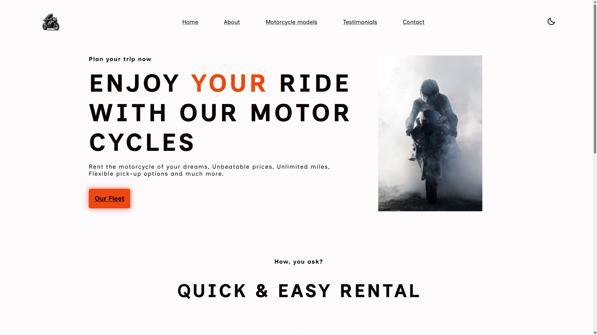

# 🏍️ Motorcycle Rental Website (Currently in progress)

A responsive, theme-switchable web application for browsing and renting motorcycles.

---

## 🚀 Features

- ✅ Responsive design
- ✅ Dynamic bike selection with image preview
- ✅ Detailed specs table per model
- ✅ Light/Dark mode toggle 🌞🌙
- ✅ Automatic app opening anchors(contacts-dial, socials)

---

## 📸 Demo

> You can view a live demo [here](https://antvndev.github.io/Motorcycle-Rental/)

---

## 🔧 Tech Stack used

- HTML5 / CSS3
- Vanilla JavaScript (ES6+)
- JSON (for bike data)
- Google Fonts (Inclusive Sans)
- Boxicons (for icons)
- Font Awesome (for icons)
